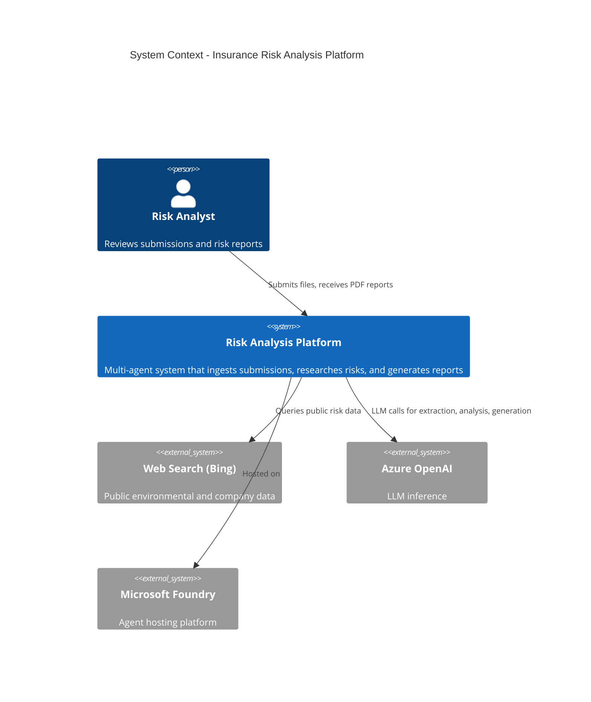
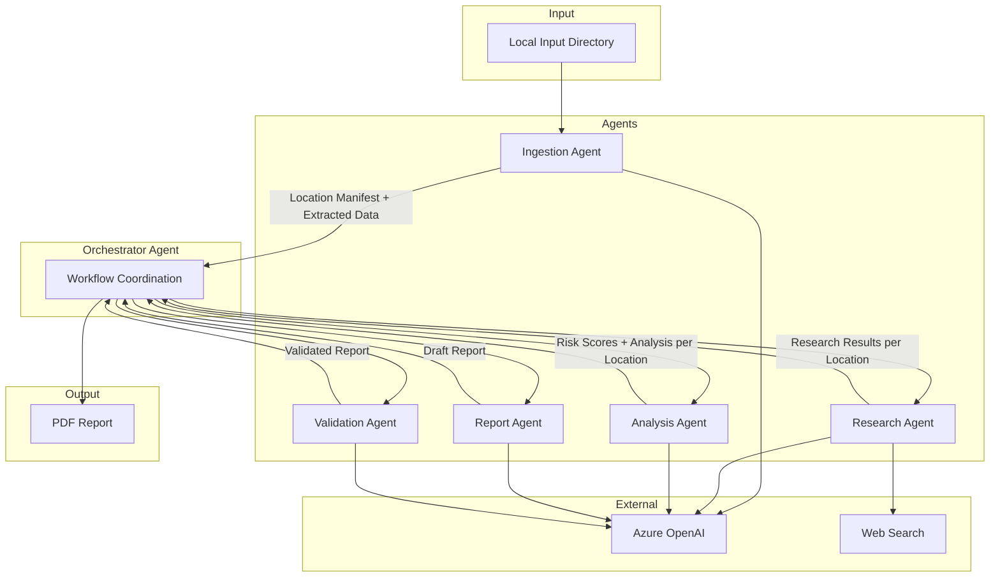
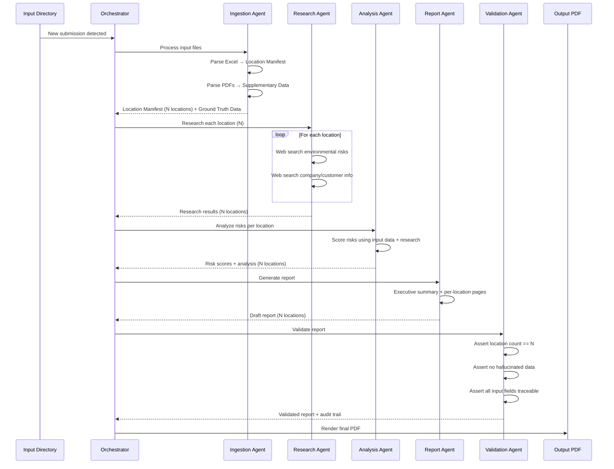

# Architecture Overview
## Version: 0.1.0

## 1. System Context Diagram

## 2. Component Architecture

## 3. Data Flow

## 4. Data Model

| Entity | Key Fields | Relationships |
|--------|-----------|---------------|
| **Submission** | id, timestamp, source_files[], status | Has many Locations |
| **Location** | id, submission_id, name, address, city, state, zip, country, building_type, construction_type, year_built, stories, sqft, TIV, all risk zone fields | Belongs to Submission; Has one RiskScore; Has many ResearchResults |
| **ResearchResult** | id, location_id, source_url, data_type, content, retrieved_at | Belongs to Location |
| **RiskScore** | id, location_id, overall_score, flood_score, earthquake_score, hurricane_score, tornado_score, wildfire_score, climate_trend_score | Belongs to Location |
| **AuditEntry** | id, submission_id, agent, action, input_hash, output_hash, timestamp, location_count_check | Belongs to Submission |
| **Report** | id, submission_id, pdf_path, generated_at, validation_status | Belongs to Submission |

## 5. Technology Stack

| Layer | Technology | Rationale |
|-------|-----------|-----------|
| Agent Platform | Microsoft Foundry | Mandated; agent hosting and lifecycle |
| Agent Framework | Microsoft Agent Framework | Mandated; multi-agent orchestration |
| LLM | Azure OpenAI (GPT-4.1 or equivalent) | Extraction, analysis, generation |
| Web Search | Bing Grounding / Web Search API | Public environmental data research |
| Document Parsing | Azure Document Intelligence or Python libs | Excel and PDF extraction |
| PDF Generation | Python (ReportLab / WeasyPrint) | Report rendering |
| Runtime | Python 3.11+ | Agent implementation language |
| Storage | Local filesystem (v1) | Input/output file storage |

## 6. Key Design Decisions

| ID | Decision | Rationale | Status |
|----|----------|-----------|--------|
| ADD-001 | Dedicated Validation Agent | Critical requirement for location count integrity; separation of concerns ensures validation is never bypassed | Accepted |
| ADD-002 | Location Manifest as ground truth | Single source of truth created at ingestion; all downstream agents reference this manifest | Accepted |
| ADD-003 | Multi-agent over single agent | Research, analysis, and validation have distinct concerns; parallel location research benefits from agent separation | Accepted |
| ADD-004 | Audit trail in report | Analyst needs to trust output; embedded provenance satisfies auditability without separate UI | Accepted |
| ADD-005 | Local filesystem for v1 | Simplifies initial development; email ingestion deferred to future phase | Accepted |
| ADD-006 | Fully autonomous pipeline | Analyst does not intervene mid-process; validation agent handles integrity internally | Accepted |

## 7. Security Architecture

- **Data in transit**: All Azure service calls over HTTPS/TLS 1.2+
- **Data at rest**: Local filesystem; no sensitive data persisted beyond submission lifecycle
- **LLM guardrails**: System prompts constrain output to factual, source-backed analysis
- **No PII exposure**: Customer contact info from input files excluded from web search queries
- **API keys**: Stored in environment variables or Azure Key Vault (not in code)

## 8. Observability Architecture

- **Logging**: Structured JSON logs per agent action (agent, action, timestamp, location_count)
- **Audit trail**: Per-submission audit entries tracking location count at each pipeline stage
- **Health checks**: Agent readiness and LLM endpoint availability
- **Error reporting**: Failed locations flagged in report with reason; pipeline does not silently drop locations

## 9. Infrastructure Requirements (Non-Implementation)

- Azure OpenAI endpoint with sufficient TPM for several submissions/day
- Bing Search API or Grounding API access
- Microsoft Foundry project with agent deployment capability
- Local machine or VM with Python 3.11+, filesystem access to input/output directories
- Sufficient context window for processing large location sets (consider batching for >50 locations)
