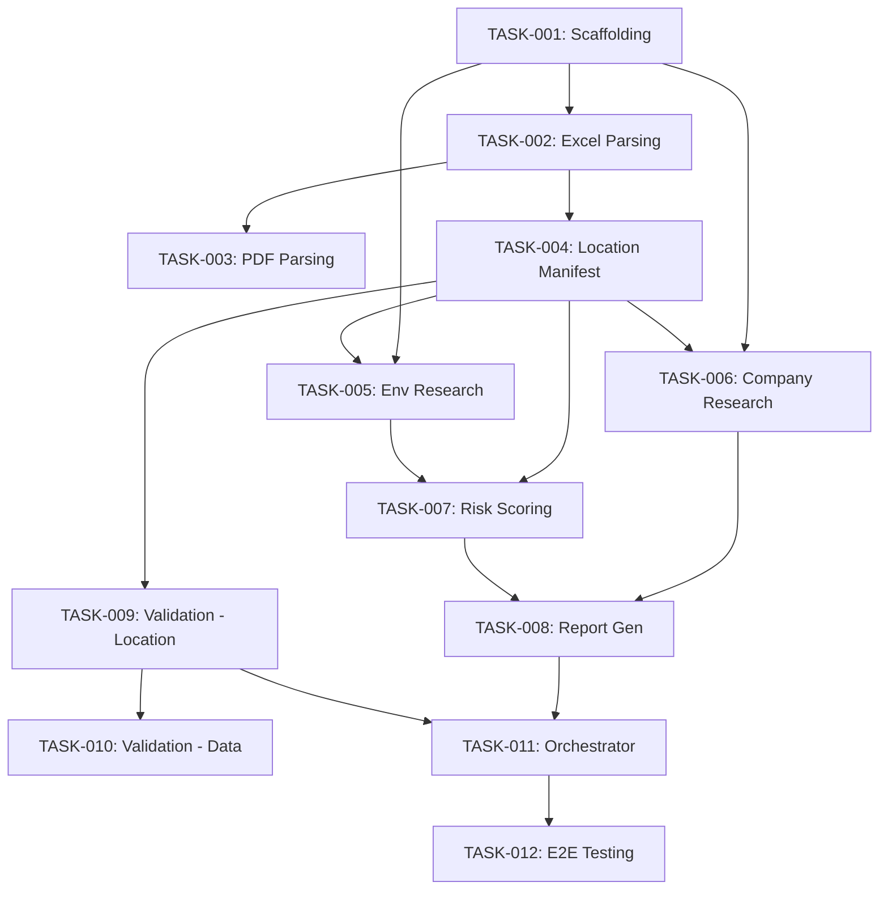

# Task Backlog (Agent Handoff)
## Version: 0.1.0

This file is the contract for downstream development agents.

---

## Task Structure

### TASK-001: Project Scaffolding and Agent Framework Setup
- **Source Requirements**: [REQ-F-012]
- **Type**: Infrastructure
- **Priority**: P0
- **Estimated Complexity**: M
- **Dependencies**: []
- **Acceptance Criteria**:
  - [ ] Microsoft Foundry project initialized
  - [ ] Microsoft Agent Framework configured with multi-agent support
  - [ ] Python project structure with dependency management
  - [ ] Azure OpenAI and Web Search connections configured
  - [ ] Input/output directory paths configurable
- **Agent Assignment**: unassigned
- **Status**: Backlog

---

### TASK-002: Ingestion Agent - Excel Parsing
- **Source Requirements**: [REQ-F-001, REQ-F-002, REQ-F-004]
- **Type**: Feature
- **Priority**: P0
- **Estimated Complexity**: M
- **Dependencies**: [TASK-001]
- **Acceptance Criteria**:
  - [ ] Reads Excel files from input directory
  - [ ] Extracts all location rows with full field schema
  - [ ] Produces Location Manifest with unique IDs and count hash
  - [ ] Handles missing/malformed fields gracefully (flag, don't drop)
- **Agent Assignment**: unassigned
- **Status**: Backlog

---

### TASK-003: Ingestion Agent - PDF Parsing
- **Source Requirements**: [REQ-F-001, REQ-F-003, REQ-F-004]
- **Type**: Feature
- **Priority**: P1
- **Estimated Complexity**: L
- **Dependencies**: [TASK-001, TASK-002]
- **Acceptance Criteria**:
  - [ ] Extracts text content from PDF files
  - [ ] Uses LLM to identify location data in unstructured text
  - [ ] Merges PDF-sourced locations into Location Manifest (supplementary to Excel)
  - [ ] Assigns confidence scores to extracted locations
- **Agent Assignment**: unassigned
- **Status**: Backlog

---

### TASK-004: Location Manifest Implementation
- **Source Requirements**: [REQ-F-004, REQ-NF-001]
- **Type**: Feature
- **Priority**: P0
- **Estimated Complexity**: S
- **Dependencies**: [TASK-002]
- **Acceptance Criteria**:
  - [ ] Manifest data structure with immutable location list
  - [ ] Hash/checksum for integrity verification
  - [ ] Count assertion utility used by all downstream agents
  - [ ] Serializable for inter-agent communication
- **Agent Assignment**: unassigned
- **Status**: Backlog

---

### TASK-005: Research Agent - Environmental Risk Search
- **Source Requirements**: [REQ-F-005, REQ-NF-007]
- **Type**: Feature
- **Priority**: P0
- **Estimated Complexity**: L
- **Dependencies**: [TASK-001, TASK-004]
- **Acceptance Criteria**:
  - [ ] Performs web search for each location's environmental risks
  - [ ] Covers all risk categories (flood, earthquake, hurricane, etc.)
  - [ ] Records source URLs for all data retrieved
  - [ ] Strips PII from search queries
  - [ ] Returns results keyed by location ID
  - [ ] Handles rate limiting and search failures gracefully
- **Agent Assignment**: unassigned
- **Status**: Backlog

---

### TASK-006: Research Agent - Company/Customer Research
- **Source Requirements**: [REQ-F-006, REQ-NF-007]
- **Type**: Feature
- **Priority**: P1
- **Estimated Complexity**: M
- **Dependencies**: [TASK-001, TASK-004]
- **Acceptance Criteria**:
  - [ ] Searches public info about the customer company
  - [ ] Captures company overview, industry, relevant news
  - [ ] Records source URLs
  - [ ] No PII in search queries
- **Agent Assignment**: unassigned
- **Status**: Backlog

---

### TASK-007: Analysis Agent - Risk Scoring
- **Source Requirements**: [REQ-F-007, REQ-NF-002]
- **Type**: Feature
- **Priority**: P0
- **Estimated Complexity**: L
- **Dependencies**: [TASK-004, TASK-005]
- **Acceptance Criteria**:
  - [ ] Generates per-location risk scores (overall + per-category)
  - [ ] Uses input data fields as primary scoring signals
  - [ ] Supplements with research findings
  - [ ] Consistent methodology across all locations
  - [ ] Captures scoring rationale for each location
  - [ ] Marks categories with insufficient data
- **Agent Assignment**: unassigned
- **Status**: Backlog

---

### TASK-008: Report Agent - PDF Generation
- **Source Requirements**: [REQ-F-008, REQ-F-011, REQ-NF-009]
- **Type**: Feature
- **Priority**: P0
- **Estimated Complexity**: L
- **Dependencies**: [TASK-006, TASK-007]
- **Acceptance Criteria**:
  - [ ] Generates executive summary section
  - [ ] Generates company overview section
  - [ ] Generates per-location detail pages (exactly N)
  - [ ] Includes risk scores, narrative analysis, source citations per location
  - [ ] Includes audit summary appendix
  - [ ] Renders to PDF with professional formatting
  - [ ] Table of contents with navigation
- **Agent Assignment**: unassigned
- **Status**: Backlog

---

### TASK-009: Validation Agent - Location Integrity
- **Source Requirements**: [REQ-F-009, REQ-NF-001]
- **Type**: Feature
- **Priority**: P0
- **Estimated Complexity**: M
- **Dependencies**: [TASK-004]
- **Acceptance Criteria**:
  - [ ] Checks location count at every stage transition
  - [ ] Cross-references location IDs between manifest and outputs
  - [ ] Halts pipeline on any discrepancy
  - [ ] Records validation results in audit trail
  - [ ] Has veto power over report emission
- **Agent Assignment**: unassigned
- **Status**: Backlog

---

### TASK-010: Validation Agent - Data Integrity
- **Source Requirements**: [REQ-F-010, REQ-NF-002, REQ-NF-008]
- **Type**: Feature
- **Priority**: P0
- **Estimated Complexity**: L
- **Dependencies**: [TASK-009]
- **Acceptance Criteria**:
  - [ ] Verifies all numerical values trace to input or cited source
  - [ ] Detects and flags/removes unsourced claims
  - [ ] Confirms no hallucinated locations or data
  - [ ] Records all validation checks in audit trail
- **Agent Assignment**: unassigned
- **Status**: Backlog

---

### TASK-011: Orchestrator Agent
- **Source Requirements**: [REQ-F-012, REQ-NF-006]
- **Type**: Feature
- **Priority**: P0
- **Estimated Complexity**: M
- **Dependencies**: [TASK-001, TASK-002, TASK-005, TASK-007, TASK-008, TASK-009]
- **Acceptance Criteria**:
  - [ ] Coordinates full pipeline: ingest → research → analyze → report → validate
  - [ ] Passes Location Manifest to each agent
  - [ ] Handles retries and failure recovery
  - [ ] Enforces validation gate before output
  - [ ] Logs structured events at each transition
- **Agent Assignment**: unassigned
- **Status**: Backlog

---

### TASK-012: End-to-End Integration Testing
- **Source Requirements**: [REQ-NF-001, REQ-NF-002, REQ-NF-003]
- **Type**: Testing
- **Priority**: P0
- **Estimated Complexity**: M
- **Dependencies**: [TASK-011]
- **Acceptance Criteria**:
  - [ ] Test with sample Excel file (5, 10, 50 locations)
  - [ ] Verify location count integrity end-to-end
  - [ ] Verify no hallucinated data in output
  - [ ] Verify report completeness (all sections present)
  - [ ] Performance within time targets
- **Agent Assignment**: unassigned
- **Status**: Backlog

---

## Dependency Graph

## Priority Ordering (Suggested Build Sequence)

1. **TASK-001** → Scaffolding
2. **TASK-002** → Excel ingestion
3. **TASK-004** → Location Manifest
4. **TASK-009** → Validation (location integrity)
5. **TASK-005** → Environmental research
6. **TASK-007** → Risk scoring
7. **TASK-008** → Report generation
8. **TASK-010** → Data validation
9. **TASK-011** → Orchestrator
10. **TASK-006** → Company research
11. **TASK-003** → PDF parsing
12. **TASK-012** → E2E testing

---

## Traceability Matrix

| REQ ID | DEV Tasks | TEST Tasks | DEPLOY Tasks | SPIKE Tasks |
|--------|-----------|------------|--------------|-------------|
| REQ-F-001 | DEV-003, DEV-004, DEV-012 | TEST-001 | — | — |
| REQ-F-002 | DEV-003 | TEST-001 | — | — |
| REQ-F-003 | DEV-004 | TEST-001 | — | — |
| REQ-F-004 | DEV-002, DEV-003, DEV-004 | TEST-001 | — | — |
| REQ-F-005 | DEV-005 | TEST-002 | — | — |
| REQ-F-006 | DEV-006 | TEST-002 | — | — |
| REQ-F-007 | DEV-007 | TEST-002 | — | — |
| REQ-F-008 | DEV-010 | TEST-004 | — | — |
| REQ-F-009 | DEV-008 | TEST-003 | — | SPIKE-001 |
| REQ-F-010 | DEV-009 | TEST-003 | — | SPIKE-001 |
| REQ-F-011 | DEV-010 | TEST-004 | — | — |
| REQ-F-012 | DEV-001, DEV-011, DEV-012 | TEST-005 | DEPLOY-001, DEPLOY-002 | — |
| REQ-NF-001 | DEV-002, DEV-008 | TEST-003, TEST-005 | — | — |
| REQ-NF-002 | DEV-007, DEV-009 | TEST-002, TEST-003 | — | SPIKE-001 |
| REQ-NF-003 | — | TEST-005 | — | — |
| REQ-NF-004 | DEV-012 | TEST-005 | DEPLOY-002 | — |
| REQ-NF-005 | DEV-008, DEV-009 | TEST-003 | — | — |
| REQ-NF-006 | DEV-011 | TEST-005 | — | — |
| REQ-NF-007 | DEV-005, DEV-006 | TEST-002 | — | — |
| REQ-NF-008 | DEV-009 | TEST-003 | — | SPIKE-001 |
| REQ-NF-009 | DEV-010 | TEST-004 | — | — |
