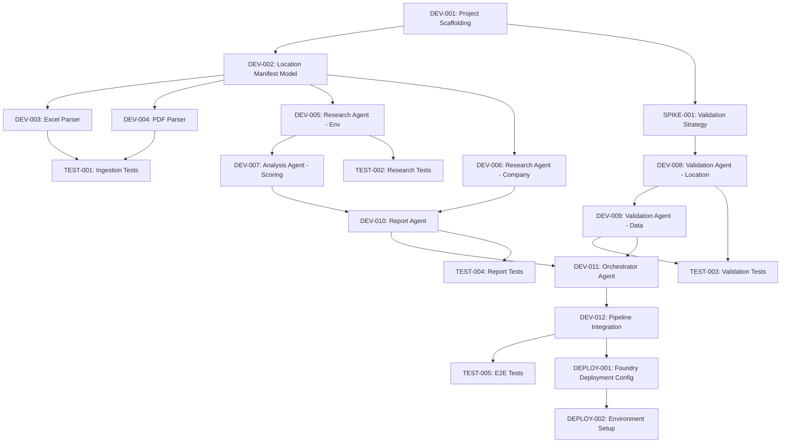

# Task Plan
## Version: 1.0.0
## PRD Version: 0.1.0
## Date: 2026-05-26
## Status: Draft

## Summary
- Total Tasks: 20
- DEV: 12 | TEST: 5 | DEPLOY: 2 | SPIKE: 1
- P0: 13 | P1: 5 | P2: 2

## Execution Order

## Phase Plan

### Phase 1: Foundation
- Tasks: [DEV-001, DEV-002, SPIKE-001]
- Goal: Project skeleton, core data model, validation strategy proven
- Exit Criteria: Agent framework running, Location Manifest serializable, validation approach documented

### Phase 2: Ingestion
- Tasks: [DEV-003, DEV-004, TEST-001]
- Goal: Files → Location Manifest pipeline working
- Exit Criteria: Excel and PDF files produce correct, immutable manifests with integrity hashes

### Phase 3: Research & Analysis
- Tasks: [DEV-005, DEV-006, DEV-007, TEST-002]
- Goal: Per-location environmental research and risk scoring operational
- Exit Criteria: Each location gets research results and risk scores; PII stripped from queries

### Phase 4: Validation
- Tasks: [DEV-008, DEV-009, TEST-003]
- Goal: Validation agent enforces location and data integrity
- Exit Criteria: Validation agent vetoes reports with count mismatches or unsourced data; audit produced

### Phase 5: Report & Orchestration
- Tasks: [DEV-010, DEV-011, TEST-004]
- Goal: End-to-end pipeline producing validated PDF reports
- Exit Criteria: PDF generated with exec summary + N location pages + audit appendix; orchestrator coordinates full flow

### Phase 6: Integration & Deployment
- Tasks: [DEV-012, TEST-005, DEPLOY-001, DEPLOY-002]
- Goal: System runs end-to-end in target environment
- Exit Criteria: 100-location submission completes with 100% location integrity; deployed on Foundry
